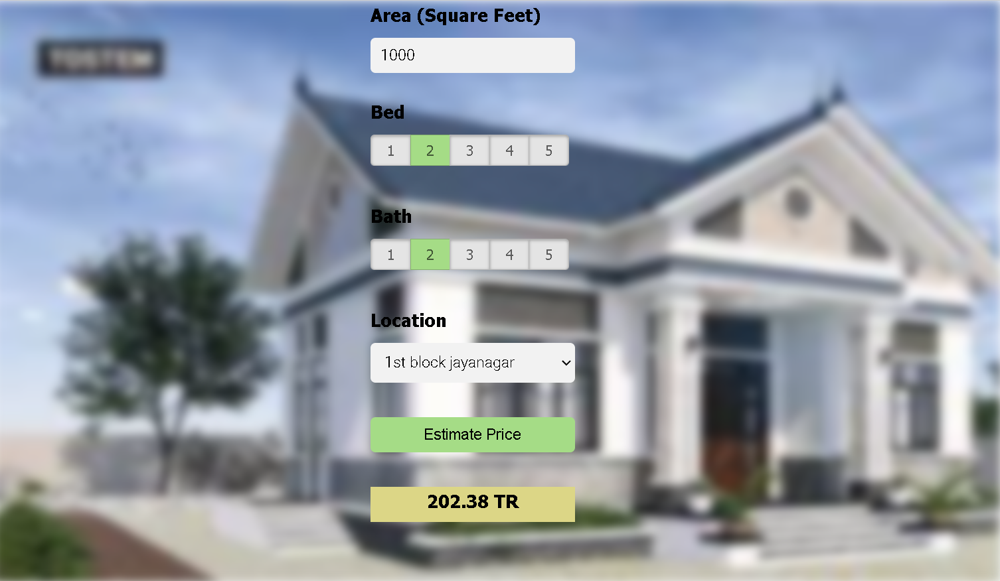

Dataset link: https://www.kaggle.com/amitabhajoy/bengaluru-house-price-data

1. Python
2. Numpy and Pandas for data cleaning
3. Matplotlib for data visualization
4. Sklearn for model building
5. Visual studio code as IDE
6. Python flask for http server
7. HTML/CSS/Javascript for UI